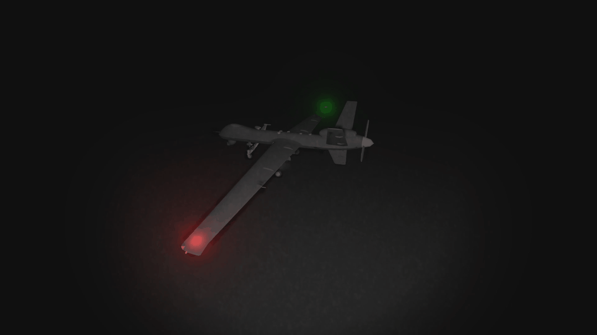
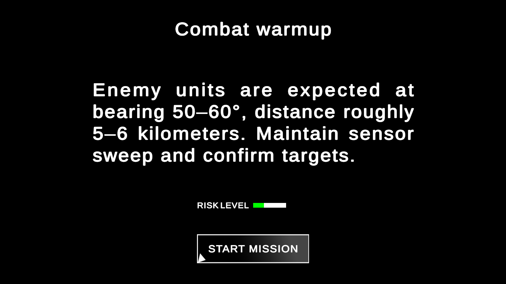
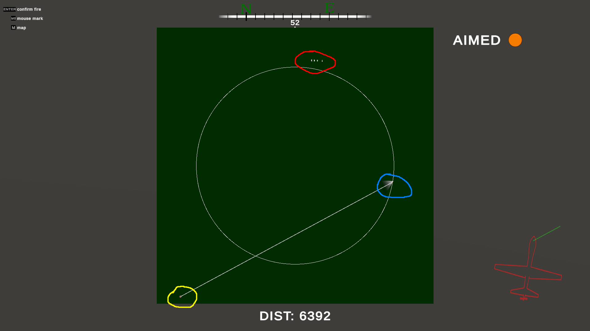
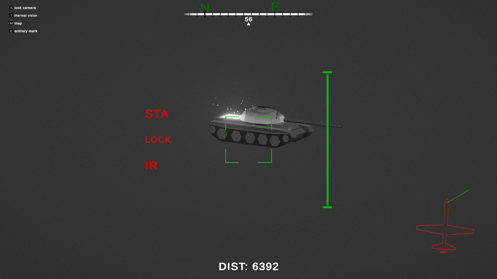
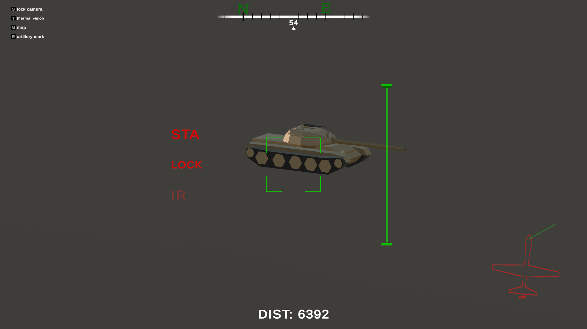
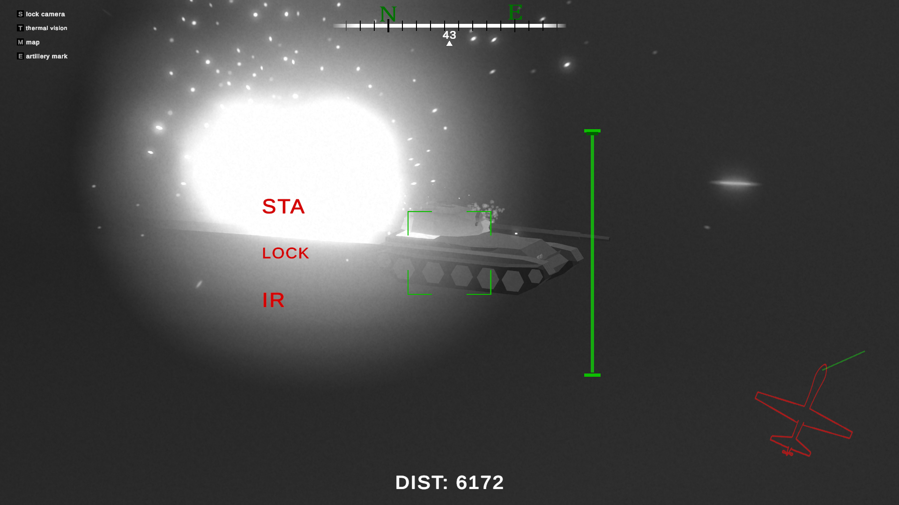
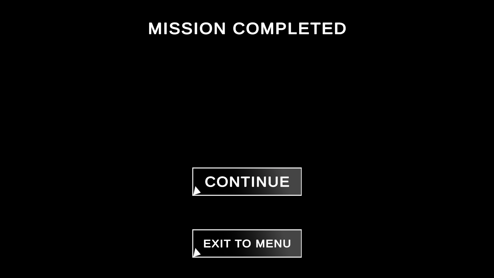

# MQ-9 Drone Simulation  

A compact UAV simulation showcasing sensor workflows, gimbal camera control, thermal vision, targeting logic, and mission-based operation.  
Built as a technical demonstration of clean Unity architecture, real-time HUD systems, and modular gameplay logic.

---

## 🎥 Preview

### Main Menu  

### Mission Intro  

### Gameplay  

---

## ✈️ Overview

This simulation demonstrates:

- Smooth inertial two-axis gimbal camera  
- Thermal vision with post-processing  
- Real-time HUD indicators (distance, compass, lock state, IR/STA)  
- Map interface with drone position, paladin artillery units and trajectory  
- Mission intro/outro system  
- Ballistic artillery integration (Paladin system)  
- Fully modular Unity architecture  

Subsystems are intentionally decoupled:  
**Input → Drone Logic → Sensors → HUD → Missions → Audio → Map UI**

---

## 📸 Screenshots

### Mission Briefing  

### Map Interface  

**Map Legend:**

- 🔵 **Drone (You)** — current UAV position and heading  
- 🔴 **Paladin Units** — artillery group, showing aim status  
- 🟡 **Target Marker** — selected strike position  
- ⚪ **Range Circles** — distance visualization for artillery engagement

### Targeting & HUD  

### Destruction / FX  

### Mission Complete  

---

## 🛠 Key Features

### 🎯 Camera & Sensors
- Smooth inertial camera rotation  
- Sensitivity scaling based on zoom  
- Rangefinder with formatted distance  
- Camera lock mode  
- Debug rays for alignment  
- Camera shake based on drone movement

### 🎛 HUD System
- Compass strip  
- Distance meter  
- IR, Lock, STA indicators  
- DOTween-driven animations (fade, pulse, typewriter)  
- Works under pause via `SetUpdate(true)`

### 🌡 Thermal Vision
- Global shader toggle  
- Volume activation  
- HeatEffect registry for emissive objects

### 🛰 Map UI
- Drone position and heading  
- Paladin icons and firing status  
- Path visualization  
- Manual mark placement  
- Look-cone and trajectory markers

### 🔥 Paladin Artillery System
- True ballistic solver (high/low angles)  
- Turret yaw/pitch motors  
- Group fire alignment  
- Trajectory visualizer  
- Firing sequence timing

### 🌍 Environment Interaction
- Terrain deformation  
- Explosion physics and damage  
- NavMesh agents reacting dynamically  
- Tanks with detachable turret

---

## 🎮 Controls

| Action | Key |
|-------|-----|
| Rotate camera | Mouse |
| Zoom | Scroll |
| Lock camera | S |
| Thermal vision | T |
| Map | M |
| Place mark | E / (mouse if map open) |
| Confirm fire | Enter |

---

## ▶ How to Build

1. Unity **2022.3 LTS** or newer  
2. Clone repository  
3. Open the project  
4. Launch **MainMenu** scene  
5. Press Play  

---

## 📘 Notes

- All UI animations use `SetUpdate(true)`  
- Thermal mode toggles all registered HeatEffects  
- Terrain deformation modifies heightmap + splatmap  
- Paladins evaluate aim readiness at group level  
- Map UI updates in real time based on drone heading and position  

---

## 📜 License

This project is licensed under the **MIT License**.

---

## 📮 Contact

📧 Email: zkostyutkin2004@gmail.com  
🧩 GitHub: https://github.com/xvostik201  

---

### 📄 Developer Note  
This project was created as part of my personal game development portfolio, showcasing real-time systems, UI architecture, and gameplay logic in Unity.

